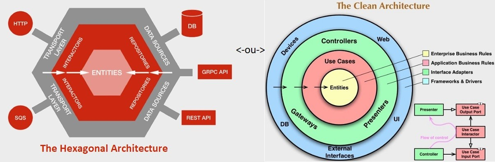

# Arquitetura Hexagonal - Exemplo de Projeto

A Arquitetura Hexagonal, também conhecida como Ports and Adapters, é uma abordagem que visa desacoplar o núcleo da aplicação de suas dependências externas, como bancos de dados, APIs, interfaces de usuário e outros sistemas externos.

## O que é Arquitetura Hexagonal?

A ideia central da Arquitetura Hexagonal é garantir que o núcleo da aplicação, a lógica de negócio, seja isolado de detalhes de implementação externa. A comunicação entre o núcleo e os sistemas externos ocorre por meio de portas (ports) e adaptadores (adapters).

### Como Funciona?

- **Núcleo da Aplicação (Core)**: Contém a lógica de negócio e as regras principais da aplicação. Ele é independente de qualquer tecnologia externa.
- **Portas (Ports)**: São interfaces que definem como os adaptadores podem se comunicar com o núcleo da aplicação. As portas podem ser de entrada (input) ou de saída (output).
- **Adaptadores (Adapters)**: São implementações específicas que conectam o núcleo da aplicação a sistemas externos. Por exemplo, um adaptador pode ser uma interface de banco de dados ou uma API externa.

### Estrutura do Repositório

```
/src
  /core
    - ApplicationService.php
    - BusinessLogic.php
  /infrastructure
    /database
      - DatabaseAdapter.php
    /api
      - ApiAdapter.php
  /userInterface
    - ConsoleApp.php
  /ports
    - InputPort.php
    - OutputPort.php
```

---

## Exemplos de Implementação

Este repositório contém um exemplo de aplicação baseada na Arquitetura Hexagonal, com três módulos que se comunicam entre si:

1. **Core**: O módulo que contém a lógica de negócios.
2. **Infrastructure**: O módulo que se conecta a bancos de dados ou APIs.
3. **User Interface**: O módulo que interage com o usuário (Console, Web, etc.).

### Fluxo de Comunicação entre os Módulos

1. **User Interface** envia uma solicitação para o **Core** via a **Porta de Entrada** (Input Port).
2. O **Core** processa a solicitação utilizando a **Lógica de Negócios** e, se necessário, chama a **Infrastructure** através da **Porta de Saída** (Output Port).
3. A **Infrastructure** realiza operações externas (exemplo: consulta ao banco de dados ou chamada a uma API) e retorna o resultado ao **Core**.
4. O **Core** envia a resposta final para a **User Interface**.

---

## Estrutura do Projeto

A estrutura do código está organizada da seguinte maneira:

1. **Core**: Contém a lógica de negócios da aplicação.
2. **Ports**: Define as interfaces de comunicação (entrada e saída).
3. **Adapters**: Implementações que conectam o núcleo a sistemas externos.
4. **User Interface**: Comunicação com o usuário, seja via console, API, etc.

## Exemplo de Implementação

A seguir, será mostrado um exemplo de como os módulos se comunicam na Arquitetura Hexagonal.

### 1. **Módulo Core**

#### ApplicationService.php
```php
<?php
namespace Core;

use Ports\InputPort;
use Ports\OutputPort;

class ApplicationService implements InputPort {
    private $businessLogic;
    private $outputPort;

    public function __construct(BusinessLogic $businessLogic, OutputPort $outputPort) {
        $this->businessLogic = $businessLogic;
        $this->outputPort = $outputPort;
    }

    public function execute($input) {
        $result = $this->businessLogic->process($input);
        $this->outputPort->send($result);
    }
}
?>
```

#### BusinessLogic.php
```php
<?php
namespace Core;

class BusinessLogic {
    public function process($input) {
        return strtoupper($input); // Exemplo simples de lógica de negócios
    }
}
?>
```

### 2. **Módulo Infrastructure (Database)**

#### DatabaseAdapter.php
```php
<?php
namespace Infrastructure\Database;

use Ports\OutputPort;

class DatabaseAdapter implements OutputPort {
    public function send($data) {
        // Simula o envio de dados para o banco de dados
        echo "Enviado para o banco de dados: " . $data;
    }
}
?>
```

### 3. **Módulo User Interface**

#### ConsoleApp.php
```php
<?php
namespace UserInterface;

use Core\ApplicationService;
use Core\BusinessLogic;
use Infrastructure\Database\DatabaseAdapter;

class ConsoleApp {
    public function run() {
        $businessLogic = new BusinessLogic();
        $databaseAdapter = new DatabaseAdapter();
        $applicationService = new ApplicationService($businessLogic, $databaseAdapter);

        $input = "Exemplo de Arquitetura Hexagonal";
        $applicationService->execute($input);
    }
}

$app = new ConsoleApp();
$app->run();
?>
```

### 4. **Interfaces (Ports)**

#### InputPort.php
```php
<?php
namespace Ports;

interface InputPort {
    public function execute($input);
}
?>
```

#### OutputPort.php
```php
<?php
namespace Ports;

interface OutputPort {
    public function send($data);
}
?>
```

## Imagem Explicativas



---

### Contribuições

Contribuições para melhorar o conteúdo e os exemplos são bem-vindas! Feel free to open issues or submit pull requests.
